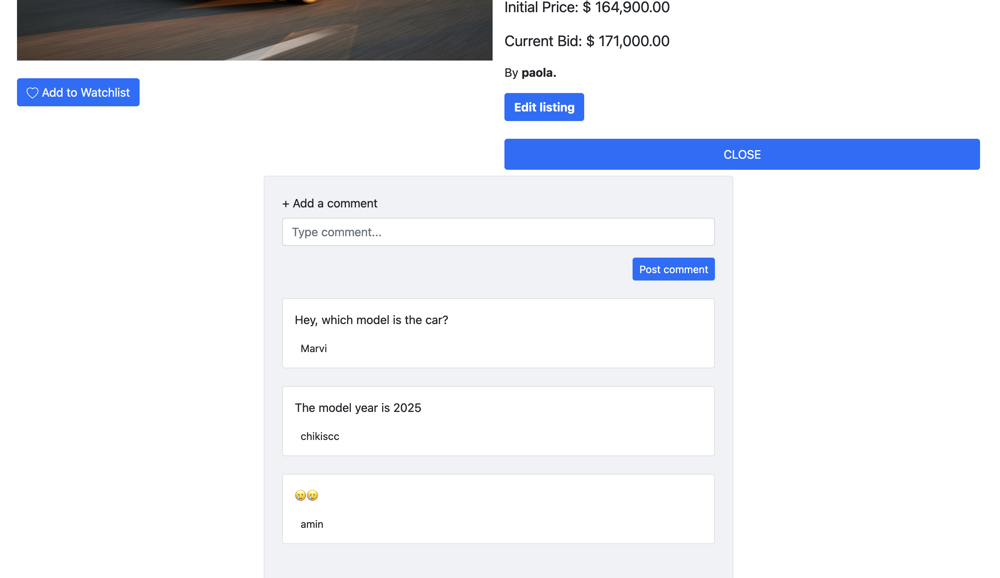

# Aplicación Web de Subastas

## Descripción
Una aplicación web que permite a los usuarios crear cuentas, ver subastas activas, comprar, vender, agregar a favoritos, y publicar nuevos artículos para subasta.

## Características
- Registro e inicio de sesión de usuarios.
- Visualización de subastas activas.
- Sistema de compra y venta de artículos.
- Gestión de favoritos y publicaciones.

## Tecnologías Utilizadas
- Python
- Django
- HTML/CSS
- Base de datos relacional: SQLite

## Instalación
1. Clona este repositorio.
   ```bash
   git clone https://github.com/usuario/nombre-del-repositorio.git

## Imagenes





